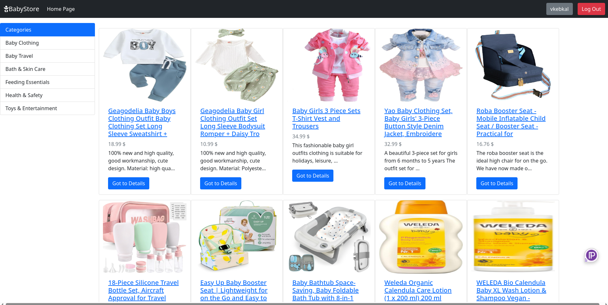
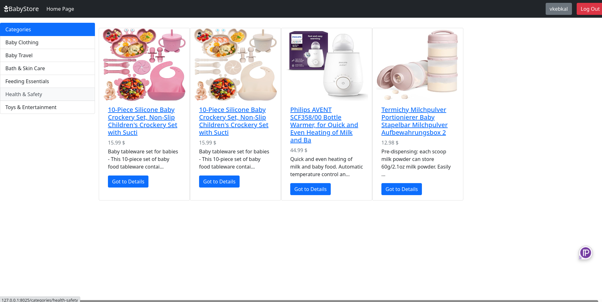
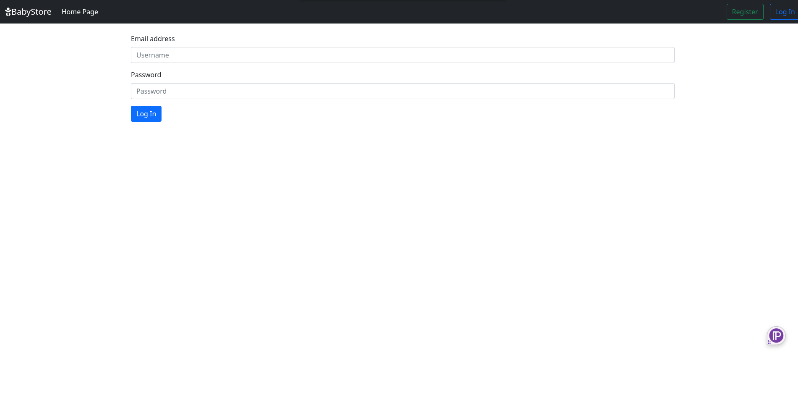
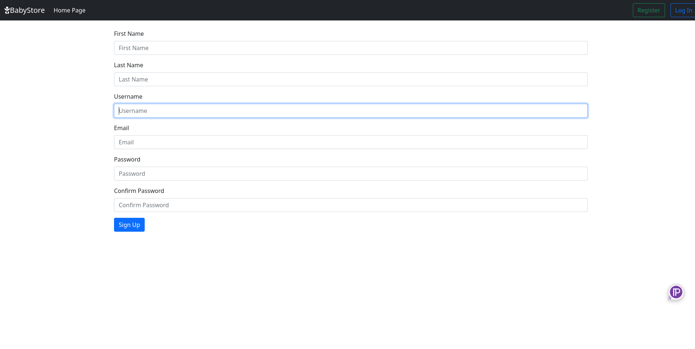
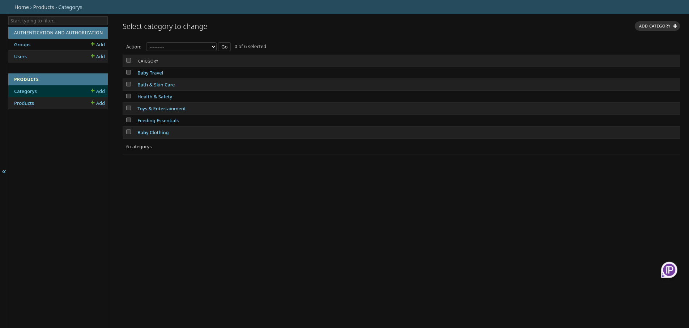

# 🍼 Baby Tools Shop

Baby Tools Shop is a Django-powered e-commerce web application designed for selling baby products such as strollers, toys, clothing, and more. This project serves as a modular, scalable foundation for building a fully functional online baby store. It includes features like product categorization, user authentication, a shopping cart system, and an admin panel for easy product and category management.

The goal of this repository is to provide developers with a flexible and extensible starting point for creating baby product-focused online shops, complete with built-in tools for customization and deployment.

---

## 📑 Table of Contents

- [🍼 Baby Tools Shop](#-baby-tools-shop)
- [🚀 Quickstart](#-quickstart)
- [⚙️ Usage](#-usage)
  - [Configuration Overview](#configuration-overview)
  - [Running on local machine](#running-in-production)
  - [Dockerfile Explanation](#dockerfile-explanation)
  - [Modifying Categories or Products in Admin Panel](#modifying-categories-or-products-in-admin-panel)
- [📁 Project Structure](#-project-structure)
- [🖼️ Screenshots](#-screenshots)

---

## 🚀 Quickstart

### ✅ Prerequisites

- Docker installed (Docker Engine + Docker Compose)
- Python 3.13
- Git

### 🏁 Starting the Application

You can start the development server easily using Docker:

```bash
# Clone the project
git clone https://github.com/vkebkal/baby-tools-shop.git
```

```bash
cd baby-tools-shop
```

```bash
# Create user to login into admin panel if not exist
python3 manage.py createsuperuser
```

```bash
# Build the image
docker build -t babyshop-app -f Dockerfile .
```

```bash
# Run the container
docker run -it -p 8025:8000 babyshop-app
```

```bash
# Or run the container in detached mode
docker run -d -it -p 8025:8000 babyshop-app
```

Now open your browser and go to [http://`<v-server-ip>`:8025](http://<v-server-ip>:8025)
---

## ⚙️ Usage

### Configuration Overview

The app is structured to allow easy configuration and customization. You can configure:

- Product categories and product data via Django admin or seed scripts
- User authentication using Django’s built-in `User` model
- Docker-based setup with automatic migration and server startup
- Port configuration using Docker’s `-p` flag


### Running on local machine
To run the app locally without Docker, follow these steps:

1. **Clone the project and go into the baby-tools-shop directory:**

```bash
# Clone the project
git clone https://github.com/vkebkal/baby-tools-shop.git
```

```bash
cd baby-tools-shop
```

2. **Create a Virtual Environment:**
```bash
python3 -m venv venv
```

3. **Activate the Virtual Environment:**

On macOS/Linux:
```bash
source venv/bin/activate
```

On Windows:
```bash
venv\Scripts\activate
```

4. **Install the Required Dependencies:**
```bash
python3 -m pip install -r requirements.txt
```

5. **Create a Superuser to Manage the App:**
```bash
cd babyshop_app/
python3 manage.py createsuperuser
```

6. **Apply Migrations and Run Server:**
```bash
python3 manage.py migrate
```

```bash
python3 manage.py runserver
```

Now open your browser and go to [http://localhost:8000](http://localhost:8000)

7. **Alternatively to 6. you can start docker contanier locally**

```bash
# Build the image
docker build -t babyshop-app -f Dockerfile .
```

```bash
# Run the container
docker run -it -p 8025:8000 babyshop-app
```
Now open your browser and go to [http://localhost:8025](http://localhost:8025)


### Modifying Categories or Products in Admin Panel

Log into the admin panel:

Run on local machine :
[http://127.0.0.1:8000/admin](http://127.0.0.1:8000/admin)

Run in docker :
[http://`<v-server-ip>`:8025/admin](http://<v-server-ip>:8025/admin)

In the admin panel, edit categories and products to populate your store.


### Dockerfile Explanation

The Dockerfile in this project sets up a Docker container for running the Django application. Here's a breakdown of each command used in the Dockerfile:

```dockerfile
# Use a pre-built Docker image as the base for the application
FROM python:3.13.3-slim
```
- This command uses the official Python 3.13.3-slim image as the base for your application, providing a minimal environment with Python pre-installed.

```dockerfile
# Set working directory
WORKDIR /app
```
- Sets the working directory inside the container to `/app`. Any subsequent commands will be run from this directory.

```dockerfile
# Copy your Django project code into the container
COPY . $WORKDIR
```
- Copies the contents of your local project (your Django project files) into the `/app` directory inside the container.

```dockerfile
# Install python dependencies
RUN python -m pip install -r requirements.txt
```
- Installs the Python dependencies listed in `requirements.txt` using `pip`. These dependencies are necessary for your Django app to run properly.

```dockerfile
# Expose Django’s default port (8000)
EXPOSE 8000
```
- Exposes port `8000`, which is Django’s default port for development.

```dockerfile
# Run the Django app in the Docker container
ENTRYPOINT ["/bin/sh", "-c", "cd babyshop_app && python manage.py migrate --noinput && python manage.py runserver 0.0.0.0:8000"]
```
- The `ENTRYPOINT` command starts the Django application inside the container. It first applies any database migrations using `python manage.py migrate` and then runs the Django development server on `0.0.0.0:8000`, making it accessible from outside the container.

---
---

## 📁 Project Structure
```
baby-tools-shop/                  # Root directory of the project
│
├── Dockerfile                    # Docker configuration to build and run the app
├── LICENSE                       # Project license file
├── README.md                     # Main README file for project documentation
├── requirements.txt              # Python dependencies (Django, Pillow, etc.)
│
├── babyshop_app/                 # Main Django application
│   ├── babyshop/                 # Core module for the baby shop functionality (models, views, setting, etc.)
│   ├── db.sqlite3                # SQLite database file for local development
│   ├── manage.py                 # Django project management script
│   ├── media/                    # Folder for uploaded media (e.g., product images)
│   ├── products/                 # Django app for managing products
│   ├── templates/                # HTML templates for views
│   ├── users/                    # Django app for managing user authentication and profiles
│
├── project_images/               # Folder containing product images (e.g., sample product images)
└── venv/                         # Python virtual environment (can be created with `python3 -m venv venv`)
    ├── bin/                      # Executable binaries for the virtual environment
    ├── include/                  # Include files for the virtual environment
    ├── lib/                      # Libraries for the virtual environment
    ├── lib64 -> lib/             # Symlink to the `lib` folder
    ├── .gitignore                # Git ignore file for the virtual environment
    └── pyvenv.cfg                # Virtual environment configuration file
```
---

## 🖼️ Screenshots

## Home Page


## Home Page with Filter


## Login Page


## Register Page


## Admin Panel
